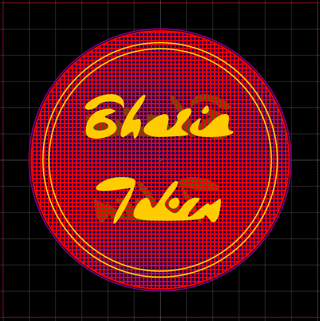
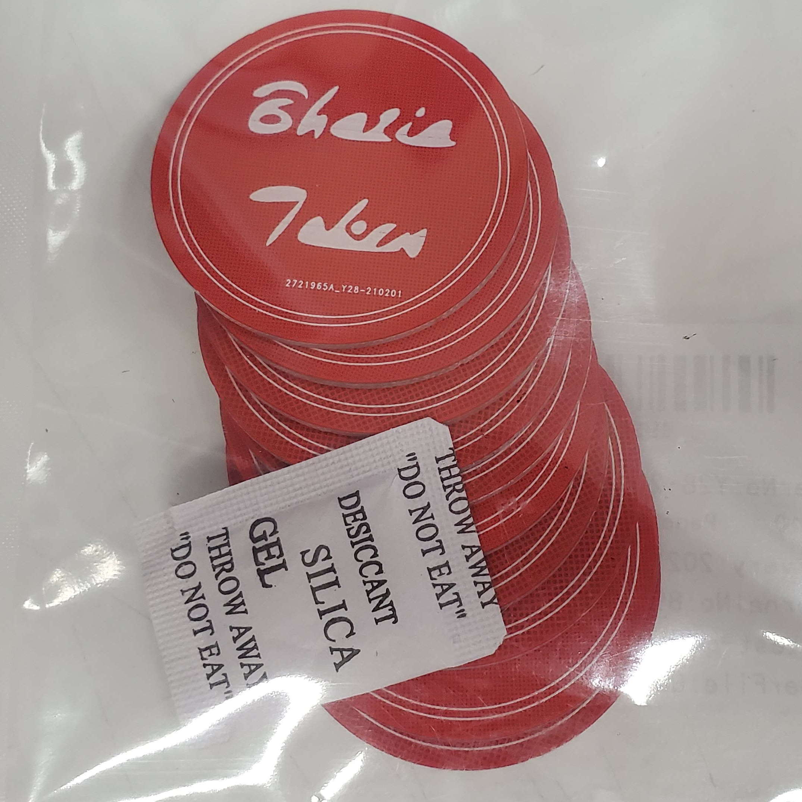

# HDMI I²C breakout

A small token to use in poker games or something.

Text drawn in Inkscape and PCB designed using [EasyEDA](https://easyeda.com/).

## Licence

Copyright © 2020, 2021 Phil Baldwin

This work is licensed under a Creative Commons Attribution-ShareAlike 4.0 International License.

You should have received a copy of the license along with this work. If not, see <http://creativecommons.org/licenses/by-sa/4.0/>.
